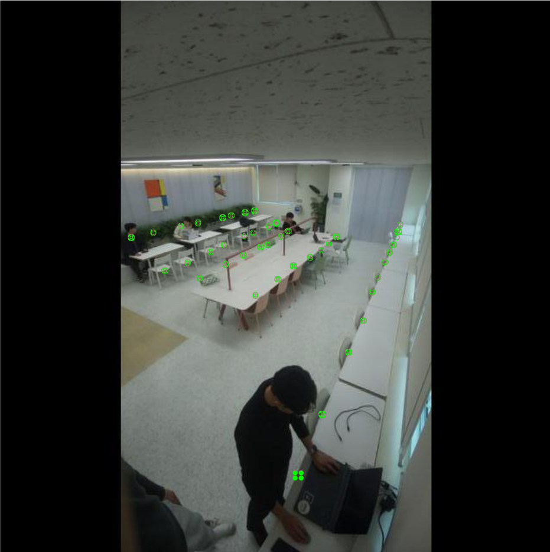
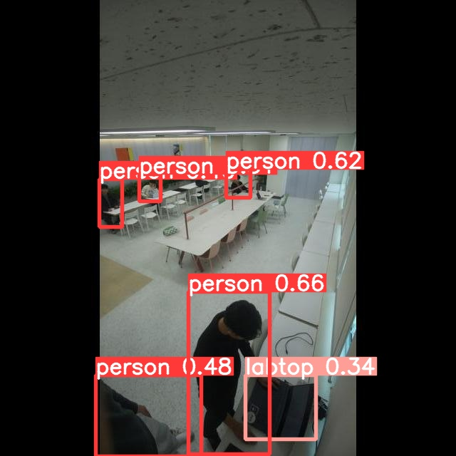
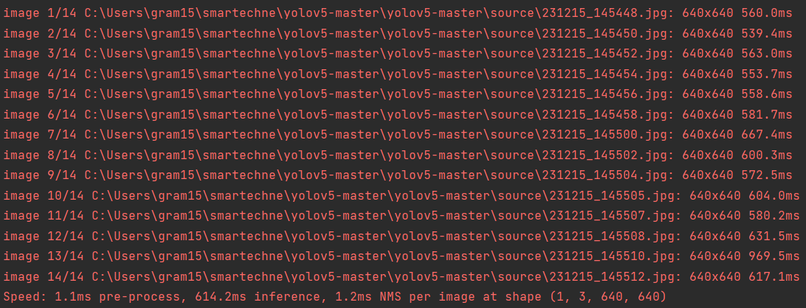

# Image detecting and matching seat with custom Yolov5

---
We created a program that attempts to match spots using our own custom yolo model.

We use detect.py to find the location of the rounding box and move.py and calculate.py to compare it to seat.txt, which is the coordinates of the seat at the camera position we fixed. 
and compare it to seat.txt, which is the coordinates of the seats from our fixed camera position. 

Seat matching uses IoU and eclidean distance. Initially, we compare IoU. This will have a value of 1 for most overlaps because the rounding box is very small.
This is because the overlap is caused by the environment, such as seating arrangement, camera angle, and other location limitations.
Therefore, even if an object occupies two spots due to 

And finally, for the instance with the most overlapping instances, i.e. the most instances of people sitting down, 
we adopt the photo from the last hour. adopt the last time photo and provide the seat information for that photo.

#### Labeling images for our own matching spots for artesian places

#### When we ran detect.py with our custom yolomodel, we got the following result

###

---

#### The detect process and the resulting value

